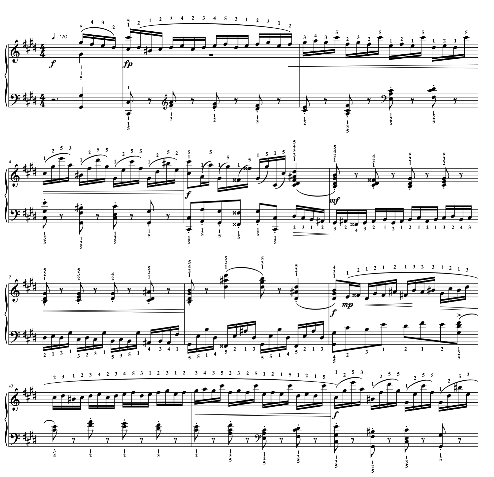

# AutoFingering
An automatic annotation tool of piano fingering based on HMM.

# Usage
Example command line:
`python autofingering sheet/sample.mxl -ddata -oparams`

```
usage: autofingering [-h] [-o OUT_FILE] [-i IN_PARAMS] [-d DATA] [-p OUT_PARAMS]
                     [--right-beam RIGHT_BEAM] [--left-beam LEFT_BEAM]
                     input_sheet

Automatic annotation of piano fingering based on HMM.

positional arguments:
  input_sheet           Input music XML file name.

optional arguments:
  -h, --help            show this help message and exit
  -o OUT_FILE, --out-file OUT_FILE
                        Annotated output music XML file name.
  -i IN_PARAMS, --in-params IN_PARAMS
                        File name of pre-trained hand model params.
  -d DATA, --data DATA  PIG data directory path.
  -p OUT_PARAMS, --out-params OUT_PARAMS
                        File name of model parameters. It is only necessary to save the learned
                        parameters.
  --right-beam RIGHT_BEAM
                        Specify right hand beam number.
  --left-beam LEFT_BEAM
                        Specify left hand beam number.
```

# Dependencies
* pandas
* numpy
* music21

# Training data
PIG format files with finger numbers are valid. You can download sample data from [here](https://beam.kisarazu.ac.jp/~saito/research/PianoFingeringDataset/).

# Input and output
They should be written in [MusicXML](https://en.wikipedia.org/wiki/MusicXML) format. 

# Sample output
The first page of Chopin etude Op.10 No.4 in C Minor "Torrent".
All finger numbers are auto-generated.


# Original paper

Nakamura, E., Saito, Y., &amp; Yoshii, K. (2020). Statistical learning and estimation of piano fingering. Information Sciences, 517, 68-85. doi:10.1016/j.ins.2019.12.068
